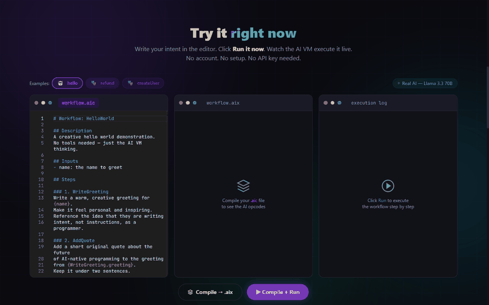
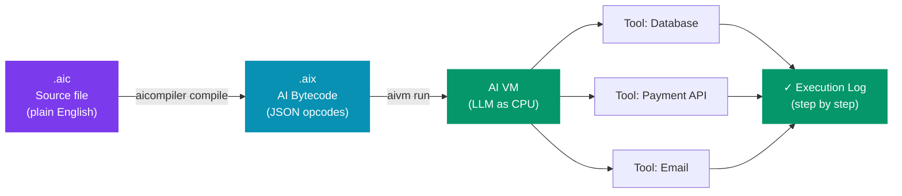
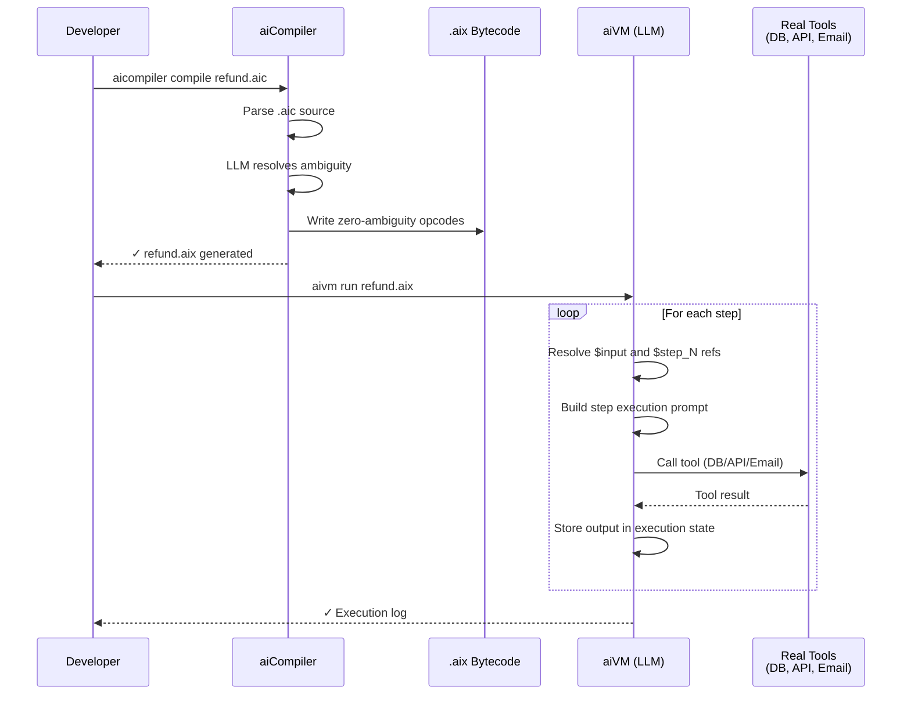

# AI Compiler

> **The first AI-native programming language. Write intent. The LLM is the CPU.**

<div align="center">

**[🚀 Try the live demo — aicompiler.dev](https://aicompiler.dev)** &nbsp;·&nbsp; No account &nbsp;·&nbsp; No install &nbsp;·&nbsp; No API key



[](LICENSE)
[](https://aicompiler.dev)
[](https://github.com/theweekendprojects)

</div>

---

## The idea

Every era of computing has had a language, a compiler, and a CPU:

| Era | Language | Compiler | CPU |
|---|---|---|---|
| 1950s | Assembly | Assembler | Silicon |
| 1990s | Java | javac | JVM |
| **2026** | **`.aic`** | **`aicompiler`** | **LLM** |

AI Compiler is not an agent framework. It is not a prompt wrapper.

It is a **programming language** where you write *what* you want to happen — in plain English — and the AI VM executes it step by step. The LLM is not a tool the runtime calls. **The LLM is the CPU.**

---

## How it works



### Step 1 — Write a `.aic` program

Plain English. No semicolons. No type annotations. No boilerplate.

```markdown
# Workflow: ProcessRefund

## Description
Processes a customer refund end-to-end.

## Inputs
- orderId: the unique identifier of the order to refund

## Tools
- database: PostgreSQL — orders and customers tables
- payment: Stripe API — for issuing refunds
- email: SendGrid — for transactional emails

## Steps

### 1. LoadOrder
Load the order record from the database using {orderId}.
Fail with "Order not found" if no record exists.

### 2. ValidateRefund
Check that {LoadOrder.status} is not "REFUNDED".
Check that {LoadOrder.createdAt} is within the last 30 days.
Fail with "Refund not eligible" if either check fails.

### 3. IssueRefund
Call the payment tool to refund {LoadOrder.total} for {LoadOrder.paymentId}.
Store the returned confirmation id as refundConfirmationId.

### 4. NotifyCustomer
Send a confirmation email to {LoadOrder.customerEmail}.
Include the refund amount and {IssueRefund.refundConfirmationId}.
If email fails, log the error but do not halt the workflow.
```

### Step 2 — Compile to `.aix` bytecode

```bash
aicompiler compile ProcessRefund.aic
```

The AI compiler reads your program, resolves all ambiguity, and produces a `.aix` file — structured JSON opcodes with zero ambiguity:

```json
{
  "workflow": "ProcessRefund",
  "version": "1.0",
  "steps": [
    {
      "id": "step_1",
      "name": "LoadOrder",
      "intent": "Retrieve the order record from the database that matches the provided orderId",
      "tool": "database",
      "action": "READ",
      "inputs": { "orderId": "$input.orderId" },
      "outputs": { "order": "full order record" },
      "on_fail": { "action": "HALT", "message": "Order not found" }
    }
  ]
}
```

The `.aix` file is **human-readable**, **versionable in git**, and **deterministic** (lock files prevent recompilation if source hasn't changed).

### Step 3 — Run with `aivm`

```bash
aivm run ProcessRefund.aix --input '{"orderId": "ORD-123"}'
```

The AI VM executes each opcode step by step:

```
▶ LoadOrder      ✓  320ms   { order: { id: "ORD-123", total: 49.99, ... } }
▶ ValidateRefund ✓  180ms   { validated: true }
▶ IssueRefund    ✓  890ms   { refundConfirmationId: "re_abc123" }
▶ NotifyCustomer ✓  450ms   { sent: true }

✓ Workflow completed successfully  (1.84s total)
```

---

## The execution model



---

## Why two steps?

Like Java compiling `.java` → `.class` before the JVM runs it, the two-step pipeline gives you a window **between compile and run** to inject:

| What you can add to `.aix` | Example |
|---|---|
| Tool bindings | Which database, which Stripe key |
| Provider selection | This step uses Claude, that one uses Nova Micro |
| Retry policies | Retry 3× on payment failure |
| Cache hints | Cache this read for 60 seconds |
| Security policies | This workflow cannot delete records |
| Lock files | Freeze compiled output for determinism |

---

## The `.aic` language

| Construct | Syntax | Purpose |
|---|---|---|
| Module | `# Workflow: Name` | Names the workflow |
| Description | `## Description` | What this workflow does |
| Inputs | `## Inputs` + `- name: description` | Runtime inputs |
| Tools | `## Tools` + `- name: description` | External systems |
| Steps | `## Steps` + `### N. StepName` | Execution steps |
| References | `{StepName.field}` or `{inputName}` | Wire data between steps |
| Error handling | `Fail with "message"` | Declare failure conditions |
| Soft errors | `log the error but do not halt` | Continue on failure |

---

## Live demo

**[aicompiler.dev](https://aicompiler.dev)** — three examples, all runnable in the browser:

| Example | Tools | Mode |
|---|---|---|
| `hello` | none | 🤖 Real AI (Llama 3.3 70B) |
| `refund` | PostgreSQL, Stripe, SendGrid | 🎭 Simulated (tools mocked) |
| `createUser` | PostgreSQL, SendGrid | 🎭 Simulated (tools mocked) |

Simulated mode shows what execution *would* look like with real tools connected. Connect your own tools via `aivm.config.json` (Phase 2).

---

## Project structure

```
ai-compiler/
├── packages/
│   └── core/                 # .aic parser, .aix compiler, AiVM engine
│       ├── src/parser/        # Markdown → AicWorkflow
│       ├── src/compiler/      # AicWorkflow → .aix (via LLM)
│       └── src/vm/            # AiVM — step loop, $ref resolver, HALT/LOG/RETRY/SKIP
├── workers/
│   └── aivm-worker/          # Cloudflare Worker API
│       ├── POST /compile      # .aic source → .aix JSON
│       ├── POST /run          # .aix + inputs → execution result
│       └── POST /stream       # .aix + inputs → NDJSON step stream
├── web/                       # aicompiler.dev (Astro 7 + React 19 + Monaco)
├── cli/                       # aicompiler + aivm CLI (Node.js)
└── examples/
    ├── hello.aic
    └── UserService.aic
```

---

## Tech stack

| Layer | Choice |
|---|---|
| AI interface | Vercel AI SDK v7 |
| Default model | Cloudflare Workers AI — Llama 3.3 70B (free) |
| Other providers | Anthropic Claude, Amazon Bedrock Nova Micro |
| Worker framework | Hono 4 |
| Web framework | Astro 7 + React 19 |
| Code editor | Monaco Editor |
| Styling | Tailwind CSS v4 |
| Deploy | Cloudflare Workers + custom domain |

---

## Roadmap

- [x] **v0.1** — Core compiler, AI VM, live demo, real AI execution
- [ ] **v0.2** — `aivm.config.json` tool adapters (Postgres, HTTP, email)
- [ ] **v0.3** — Real tool execution end-to-end (refund workflow with live Stripe)
- [ ] **v0.4** — VS Code extension — `.aic` syntax highlighting + inline errors
- [ ] **v1.0** — npm publish `aicompiler` + `aivm` CLI packages
- [ ] **Future** — Multi-agent intents, import system, AI VM debugger

---

## Deploy your own

```bash
# 1. Clone
git clone https://github.com/theweekendprojects/ai-compiler
cd ai-compiler && npm install

# 2. Deploy the AI worker (Cloudflare Workers AI — free)
cd workers/aivm-worker
npx wrangler secret put CF_ACCOUNT_ID    # your CF account ID
npx wrangler secret put CF_API_TOKEN     # Workers AI Read token
npx wrangler deploy

# 3. Deploy the web
cd ../web
CLOUDFLARE_API_TOKEN=<edit-workers-token> npx wrangler deploy
```

---

## Built by

[The Weekend Projects](https://github.com/theweekendprojects) — open source, MIT License.

*Ship tonight. Build the rest in public.*
